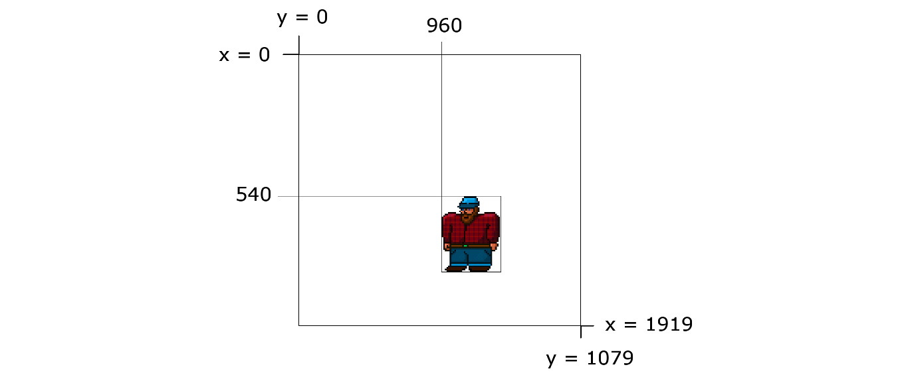
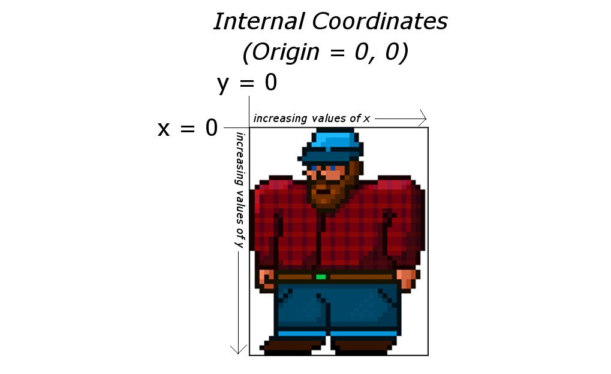

#### Basic CPP for Game Programming

```cpp

```

```cpp

```

```cpp

```

```cpp

```

```cpp

```

```cpp

```

```cpp

```

```cpp

```

```cpp

```

```cpp

```

```cpp

```

```cpp

```

```cpp

```

```cpp

```

```cpp

```

```cpp

```

```cpp

```

```cpp

```

```cpp

```

```cpp

```

```cpp

```

```cpp

```

```cpp

```

```cpp

```

```cpp

```

```cpp

```

```cpp

```

```cpp

```

```cpp

```

```cpp

```

```cpp

```

```cpp

```

```cpp

```

#### SFML

###### Creating the window

```cpp
#include <iostream>
#include <SFML/Window.hpp>


int main()
{
    sf::Window window(sf::VideoMode(700, 700), "My Window");
    while (window.isOpen())
    {
        sf::Event event;
        while (window.pollEvent(event))
        {
            if (event.type == sf::Event::Closed)
            {
                std::cout << "Closing the window" << std::endl;
                window.close();
            }
        }

    }
    return 0;
}
```

- while this creates a window, in order to render stuff(text, shapes, textures), this is not sufficient
- instead of `sf::Window` class instance from the `Window.hpp`, we need to use `sf::RenderWindow` instance from the `Graphics.hpp` module
- `sf::RenderWindow` is derived from Window, that is most of the things that worked with Window, will work here too

```cpp
#include <iostream>
#include <SFML/Graphics.hpp>


int main()
{
    sf::RenderWindow window(sf::VideoMode(700, 700), "My Window");
    while (window.isOpen())
    {
        sf::Event event;
        while (window.pollEvent(event))
        {
            if (event.type == sf::Event::Closed)
            {
                std::cout << "Closing the window" << std::endl;
                window.close();
            }
        }

        window.clear(sf::Color::Black);
        window.display();
    }
    return 0;
}
```

###### Coordinate system for SFML





```cpp

```

```cpp

```

```cpp

```

```cpp

```

```cpp

```

```cpp

```

```cpp

```

```cpp

```

```cpp

```

```cpp

```

```cpp

```

```cpp

```

```cpp

```

```cpp

```

```cpp

```

```cpp

```

```cpp

```

```cpp

```
